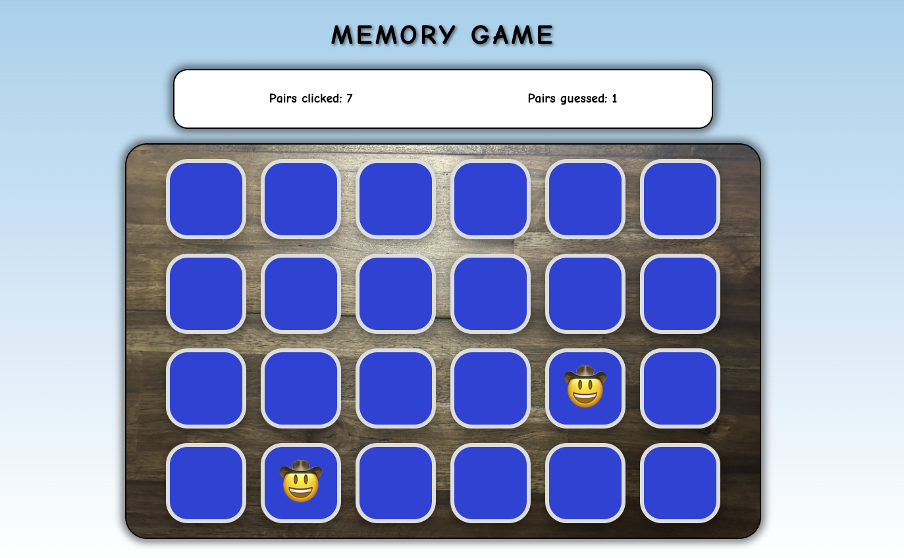

# Emoji Memory Game

## Übersicht (English version see below)

Emoji Memory Game - ein unterhaltsames wie kinderfreundliches Gedächtnisspiel, bei dem Spieler Paare von Emoji-Karten finden müssen. Das Ziel ist es, alle Matches so schnell wie möglich zu finden.

## Funktionen

- **Zufälliges Mischen**: Bei jedem Neustart des Spiels werden die Karten zufällig gemischt.
- **Spielstände anzeigen**: Sie zeigen die Anzahl der erratenen Paare und die Anzahl der Versuche an.
- **Responsives Design**: Es passt sich verschiedenen Bildschirmgrößen an, damit das Spiel auf allen Geräten gut aussieht.
- **Kindgerechtes Design**: Heller, fröhlicher Hintergrund und kinderfreundliche Emojis.

## Installation und Verwendung

### Voraussetzungen

- Ein Webbrowser (z.B. Chrome, Firefox, Safari)

- Hier geht's zum Spiel:
https://scwdmemorygame.netlify.app/

### Spielanleitung

1. Öffnen Sie das Spiel im Browser.
2. Klicken Sie auf eine Karte, um sie aufzudecken.
3. Versuchen Sie, die passenden Paare zu finden, indem Sie auf zwei Karten nacheinander klicken.
4. Wenn zwei Karten übereinstimmen, bleiben sie aufgedeckt. Wenn nicht, werden sie wieder verdeckt.
5. Das Spiel endet, wenn alle Paare gefunden wurden.
6. Behalten Sie Ihre Fortschritte mit den angezeigten Spielständen im Blick.

## Verwendete Technologien

- **HTML**: HTML enthält die Struktur des Spiels.
- **CSS**: Ein einfaches CSS-Styling, das das Design und Layout des Spiels steuert.
- **Typescript**: Typescript, das die Logik des Spiels implementiert, einschließlich des Mischens der Karten und der Ereignissteuerung.

## Mitwirkende
[André](https://github.com/cadeteandreEntwickler) und [Lamia](https://github.com/lamianicole) sind beide Schüler eines Web-Development-Bootcamps und haben in einem Partnerprojekt zusammen am Emoji Memory Project gearbeitet. 
Neu erlernte Fähigkeite in HTML, CSS und Typescript konnten hier umgesetzt werden.

Dieses Spiel lässt sich auf Design-Ebene weiter ausbauen, und insbesondere in Bezug auf die Funktionen des Spiels lässt sich noch mehr aus diesem Spiel herausholen. 

# Ein Blick ins Spiel #

# Emoji Memory Game - English Version

## Overview

Emoji Memory Game - a fun and kid-friendly memory game where players have to find pairs of emoji cards. The goal is to find all matches as quickly as possible.

## Features

- **Random Shuffle**: Every time the game restarts, the cards are shuffled randomly.
- **Show Scores**: They show the number of pairs guessed and the number of attempts.
- **Responsive Design**: It adapts to different screen sizes so the game looks good on all devices.
- **Kid-friendly Design**: Bright, cheerful background and kid-friendly emojis.

## Installation and use

### Requirements

- A web browser (e.g. Chrome, Firefox, Safari)

- Click here for the game:
https://scwdmemorygame.netlify.app/

### How to play
1. Open the game in the browser.
2. Click on a card to reveal it.
3. Try to find the matching pairs by clicking on two cards one after the other.
4. If two cards match, they remain face up. If not, they are covered again.
5. The game ends when all pairs have been found.
6. Monitor your progress with the saved games displayed.

## Technologies used

- **HTML**: HTML contains the structure of the game.
- **CSS**: A simple CSS styling that controls the design and layout of the game.
- **Typescript**: Typescript that implements the game's logic, including card shuffling and event control.

## Contributors
[André](https://github.com/cadeteandredeveloper) and [Lamia](https://github.com/lamianicole) are both students of a web development boot camp and worked together on the Emoji Memory Project in a partner project. 
Newly learned skills in HTML, CSS and Typescript could be implemented here.

This game can be further expanded on a design level, and more can be achieved from this game, especially in terms of the game's features. 

# A look into the game #

